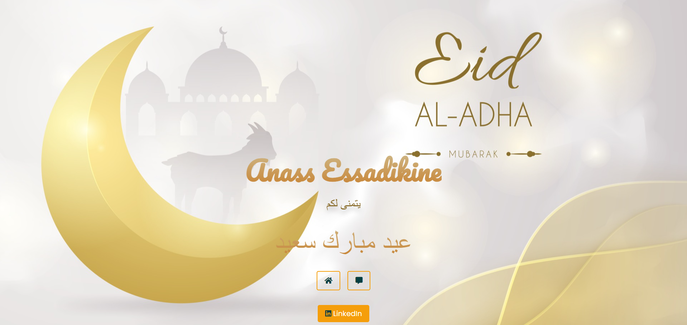

# Greeting Page

A simple greeting page for Eid Al-Adha with a beautiful background image, interactive buttons to switch between messages, and footer links to social media profiles.

## Preview



## Features

- Animated greetings in Arabic
- Switch between two different greeting messages
- Footer links to Instagram and LinkedIn profiles

## Technologies Used

- HTML
- CSS (Tailwind CSS, custom styles)
- JavaScript
- Font Awesome for icons
- Animate.css for animations

## Setup

1. Clone the repository:
    ```bash
    git clone https://github.com/ESSADIKINE/eid-mubarak.git
    ```

2. Open `index.html` in your browser to view the greeting page.

## Files

- `index.html`: The main HTML file for the greeting page.
- `style.css`: The custom CSS file for styling.
- `script.js`: The JavaScript file for interactivity.
- `bg.jpg`: Background image used in the project.

## Customization

### Changing the Greeting Messages

To change the greeting messages, modify the content inside the `<section id="anass">` and `<section id="essadikine">` in the `index.html` file.

### Updating the Footer Links

To update the footer links, modify the `href` attributes of the anchor tags in the footer section of the `index.html` file.
